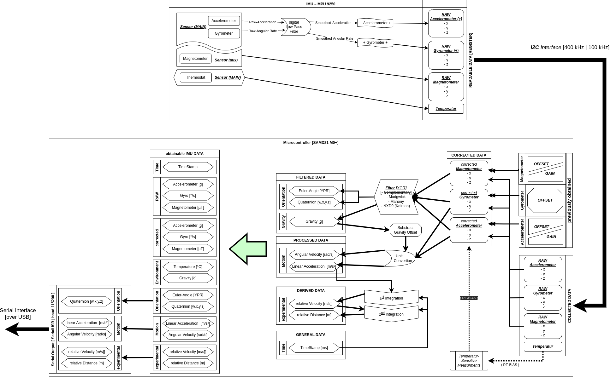

# arduino_firmware
This Package provides the firmware to publish IMU data to a main
computing unit like a NVIDIA Jetson Boards as well as additional
firmware to perform calibration procedures.

## Structural Overview


## AHRS firmware
This firmware type is used to read raw IMU sensor module data,
process and correct this information to obtain orientation,
angular velocity, linear acceleration as well as additional useful
data. Afterwards the desired as well as required data is transmitted
to the main computing unit over a serial connection.
Beside the ability to collect (more or less) raw IMU data, one major
part of this AHRS is the correction and processing step of IMU sensor
data.
As a correction step sensor-module-specific offset and gain values
identified by calibration procedures are applied to the raw IMU
sensor values.
To process and smooth the corrected imu data filter algorithms are
used. Therefore, a small subset of possible filter algorithms are
available (Mahony | Madgwick | NXP fusion/Kalman).
As a result of the filter process orientation, linear acceleration
and angular velocity as well as useful additional data is generated,
that will be sent over the serial-over-USB interface.

### Additional Information:
- **Firmware-Filter-Options**:
	- Mahony [lowest memory/computation]
	- Madgwick [fair memory/computation]
	- NXP fusion/Kalman [highest memory/computation].

## calibration firmware
Beside the basic AHRS firmware additional calibration firmware for
specific IMU sensor module components are provided.
Therefore, for every component of an IMU sensor module
(Accelerometer|Gyroscope|Magnetometer) a dedicated calibration
firmware is provided. So only one single IMU sensor module component
can be calibrated at the same time. To perform a calibration for a
specific sensor module component the corresponding calibration
firmware needed to be flashed to the MCU.

## Recommendations regarding MCUs
It is recommended to run this AHRS firmware on Hardware, which is at
least similar or better than SAMD21 (ARM Cortex M0+) MCUs.
Considerable suggestions are for example RP2040 based MCUs because of
their relative fast (133 MHz) Dual-Core ARM Cortex M0+ processor.
In addition, also a SAMD51 (ARM Cortex M4) MCUs is advisable choice
because of its Floating-Point-Unit provided natively.

It's not approved to use any kind of AVR MCUs or anything with
similar capabilities (whether 8-Bit or 32-Bit).
This kind of algorithms as well as their implementations are
consuming a lot of space in memory and RAM.
And especially regarding 8-Bit Architectures, their limited
computational capability and processing of word-length per cycle
do also affect the value ranges of basic variable types.

## Installation
In order to use all features of this package it is necessary to
install additional non-ROS related dependencies.

### Installing arduino_firmware Library
To easily use this package zip the parent directory containing
`artus_imu_toolkit_firmware`
(eg. using nautilus > right-click on `arduino_firmware` > compress…)
After generating the zip-file start the Arduino IDE and select
`Sketch > Include Library > Add .ZIP Library...`. Then choose the
freshly generated .ZIP file and add it to your internal Arduino IDE
library. After this step (and after installing all other arduino
dependencies) you find both includable header-files
(`Sketch > Include Library > artus_imu_toolkit_firmware`) and
executable example-files (`File > Examples > artus_imu_toolkit_firmware`)
installed to your Arduino IDE.

In case to modify or adding new IMU sensor systems or algorithms
provided by this package, it is necessary to apply this changes to
the library directory directly.
(Otherwise the changes are not used while recompiling by Arduino-IDE-ToolChain)
Usually the Arduino Libraries can be found here:
`~/Arduino/libraries/artus_imu_toolkit_firmware `

### Arduino Dependencies
- ***Arduino IDE*** (or for experts: after some adjustments any other suitable microcontroller-Cross-compiling Tool-Chain)
- ***Board-Definitions***: Depending on used MCU adding additional board description to Arduino IDE Boardmanager
	- 9DOF Razor M0 IMU: https://raw.githubusercontent.com/sparkfun/Arduino_Boards/master/IDE_Board_Manager/package_sparkfun_index.json (May not work on ARM architectures because of missing cross-compiling tool-chain parts)
	- Seeed Studio XIAO: https://files.seeedstudio.com/arduino/package_seeeduino_boards_index.json
- ***Arduino Libraries***: By using the Library-Manager of Arduino IDE
	- ***MPU9250*** & ***9Dof Razor M0***:
		- https://github.com/sparkfun/SparkFun_MPU-9250-DMP_Arduino_Library/archive/master.zip
	- (Adafruit) ***LSM6DSOX_LIS3MDL***:
		- Adafruit AHRS
		- Adafruit LIS3MDL
		- Adafruit LSM6DS
		- Adafruit Unified Sensor
- ***Magnetometer Calibration:***
	- Motion Cal (https://www.pjrc.com/store/prop_shield.html)
- ***Accelerometer Calibration:***
	- Octave / Matlab

## Usage
### Macros:
Nearly every example contain a `__ROSPY__MSG__` or `__DEBUG__MSG__` macro
for enabling different output modes.
- `__ROSPY__MSG__`:
  - When enabling this macro, the output to Serial communication is set up to work with the dedicated ros-imu-publisher-node
  - When disabling this macro, all obtained data will be printed to SerialUSB in a human-readable format.
- `__DEBUG__MSG__`:
	- When enabling this macro, the output to Serial communication is set up to verbose mode
	- When disabling this macro, only necessary information will be send to SerialUSB.


### Serial Interface:
Usually Linux will assign a port numbered in ascending order to a
newly plugged in Serial-Over-USB device since startup.
In most cases the serial Device can be found at `/dev/ttyACM¿`
where `¿` will be a number. In some cases eg. using a non-official
Arduino board also that serial device can be found at `/dev/ttyUSB¿`,
where `¿` will also be a number.
For easy distinguishing between Serial devices (eg. a VESC and IMU)
one can use both Arduino IDE Serial Monitor (or Tools > Ports)
and Python-Serial. For using Python-Serial you can execute following
command to print a (detailed) list of all active Serial-Devices
found at the system:

***Python 2***:
```
python -m serial.tools.list_ports -v  
```
or
***Python 3***:
```
python3 -m serial.tools.list_ports -v 
```
Otherwise, it could be considered to define some udev rules, so the
Linux system will assign fixed virtual device names, that will be
always identical and independent of how and when the devices where
plugged-in.


## Package Structure
- **arduino_firmware**
	- artus_imu_toolkit_firmware
		- examples
			- 9DOF_Razor_M0_IMU
				- artus_9DOF_Razor_M0_acceleration_calibration
				- artus_9DOF_Razor_M0_ahrs_ROS
				- artus_9DOF_Razor_M0_compass_calibration
				- artus_9DOF_Razor_M0_gyro_calibration
			- adafruit_LSM6DSOX_LIS3MDL
				- artus_LSM6DSOX_LIS3MDL_acceleration_calibration
				- artus_LSM6DSOX_LIS3MDL_ahrs_ROS
				- artus_LSM6DSOX_LIS3MDL_compass_calibration
				- artus_LSM6DSOX_LIS3MDL_gyro_calibration
			- MPU9250
				- artus_MPU9250_acceleration_calibration
				- artus_MPU9250_ahrs_ROS
				- artus_MPU9250_compass_calibration
				- artus_MPU9250_gyro_calibration
		- script_matlab : useful for accelerometer calibration
		- src

# Useful Resources

## Calibration:
- **[Magnetometer Calibration Guide (Adafruit)](https://learn.adafruit.com/adafruit-sensorlab-magnetometer-calibration?view=all)** - Basic Instruction and Information on how to calibrate a magnetometer 
- **[Magnetometer Calibration: Motion Cal](https://www.pjrc.com/store/prop_shield.html)** — Tool suggested by the Adafruit Tutorial

## LSM6DOSX_LIS3MDL Documentation:
- **[LSM6DOSX_LIS3MDL … 9DoF Combo Breakouts and Wings (Adafruit)](https://learn.adafruit.com/st-9-dof-combo?view=all)** - General Overview of different 9 DoF IMU Sensor Modules
- **[LSM6DSOX … 6DoF IMUs Guid (Adafruit)](https://learn.adafruit.com/lsm6dsox-and-ism330dhc-6-dof-imu?view=all)** - General Overview of diferent 6DoF Acceleration/Gyro Sensor Modules
- **[LIS3MDL Guid (Adafruit)](https://learn.adafruit.com/lis3mdl-triple-axis-magnetometer?view=all)** - General Overview of LIS3MDL Magnetometer Sensor Modules

## Sparkfun - 9DOF Razor M0 IMU:
- **[Installing an Arduino Library Guide](https://learn.sparkfun.com/tutorials/installing-an-arduino-library)** - Basic information on how to install an Arduino library.
- **[SparkFun 9DoF Razor IMU M0 Repository](https://github.com/sparkfun/9DOF_Razor_IMU)** - Main repositor (including hardware files) for the MPU-9250-based SparkFun 9DoF Razor IMU M0
- **[MPU-9250 Breakout Repository](https://github.com/sparkfun/MPU-9250_Breakout)** - Main repository (including hardware files) for the MPU-9250 Breakout.
- **[Hookup Guide](https://learn.sparkfun.com/tutorials/9dof-razor-imu-m0-hookup-guide)** - Basic hookup guide for the SparkFun 9DoF Razor IMU M0, including a [section on using this library](https://learn.sparkfun.com/tutorials/9dof-razor-imu-m0-hookup-guide#using-the-mpu-9250-dmp-arduino-library).
