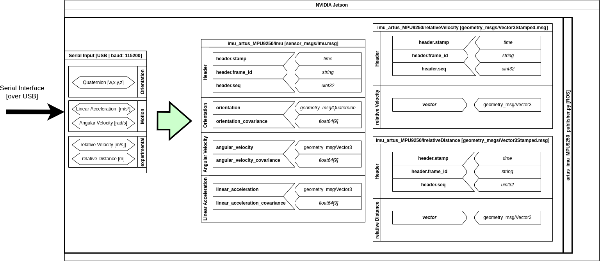

# artus_imu_publisher [ROS1]
This Package provides a ROS1 Node to read messages from a (emulated)
Serial(-USB)-Interface to publish IMU data as well as som extra
information to a ROS1 System on the main computing unit like a
NVIDIA Jetson Boards.

To run the publisher node dedicated to a supported IMU-Sensor system
start one of the provided launchfiles.

This package provides some specific config.yaml for every supported
IMU-Sensor System. These configurations are loaded into the python
publisher when starting the publisher node.
In this way every offline adjustments or modifications can be
applied more easily compared to a hardcoded solution.

In theory there is also the possibility to use the ***dynamic
reconfigure*** procedures to update these data while the node is
running.
It seems that actually this feature isn't working or not fully
implemented jet.

## Structural Overview


## Installing Arduino Firmware
1. Calibrate all Sensor Modules of your IMU Sensor System
2. Install AHRS Firmware provided by this Package to your IMU Sensor System

## Launch
For each supported IMU Sensor System one launchfile is provided.

**Sparkfun 9DOF_Razor_M0 IMU**:

	$ roslaunch artus_imu_publisher artus_imu_9DOF_Razor_M0-pub.launch

**(Adafruit) LSM6DSOX_LIS3MDL IMU**:

	$ roslaunch artus_imu_publisher artus_imu_LSM6DSOX_LIS3MDL-pub.launch

**MPU9250 IMU**:

	$ roslaunch artus_imu_publisher artus_imu_MPU9250-pub.launch

## Configure
For each IMU Sensor system a configuration YAML file is provided.
When using one of the provided launchfiles the dedicated YAML-configfile is imported automatically

configurable Options are:
- General
  - **imu_sensor_name** : Name of the sensor module system
  - **serial_port** : Serial port assigned to the IMU sensor system 
- Calibration Data:
  - **acceleration Offset** : Acceleration Bias
  - **acceleration Gain**: Acceleration Gain
  - **gyro Offset**: Gyro Bias
  - **Magnetometer Offset**: Magnetometer Bias
  - **Magnetometer Gain**: Magnetometer Gain
- Covariance Matrix:
  - **orientation Covariance**: Orientation Covariance derived from Sensors Datasheet
  - **Angular Velocity Covariance**: Angular Velocity Covariance derived from Sensors Datasheet
  - **Linear Acceleration Covariance**: Linear Acceleration Covariance derived from Sensors Datasheet

This Configuration files can be found in `config` directory.

## Dynamic Reconfigure

[*It seems that actually this feature isn't working or not fully implemented jet.*]

After having launched the publisher with one of the launch commands listed above,
it is possible to dynamically reconfigure the yaw calibration.

1) Run:


    $ rosrun rqt_gui rqt_gui -s reconfigure

or
   
	$ rosrun rqt_reconfigure rqt_reconfigure

3) Select ``artus_imu_MPU9250_pub_py_node``.

4) Change Strings or  slider to move values as desired.
   
The intent of this feature is to let you tune parameters while the ros node is still actively running.

## Usage
### Serial Interface:
Usually Linux will assign a port numbered in ascending order to a
newly plugged in Serial-Over-USB device since startup.
In most cases the serial Device can be found at `/dev/ttyACM¿`
where `¿` will be a number. In some cases eg. using a non-official
Arduino board also that serial device can be found at `/dev/ttyUSB¿`,
where `¿` will also be a number.
For easy distinguishing between Serial devices (eg. a VESC and IMU)
one can use both Arduino IDE Serial Monitor (or Tools > Ports)
and Python-Serial. For using Python-Serial you can execute following
command to print a (detailed) list of all active Serial-Devices
found at the system:

***Python 2***:
```
python -m serial.tools.list_ports -v  
```
or
***Python 3***:
```
python3 -m serial.tools.list_ports -v 
```
Otherwise, it could be considered to define some udev rules, so the
Linux system will assign fixed virtual device names, that will be
always identical and independent of how and when the devices where
plugged-in.


## Package Structure
- **artus_imu_publisher**
	- cfg : configuartion files fpr dynamic reconfiguration
	- config : offline configurations files for each supported IMU-Sensor system
	- launch : Launchfile for each supported IMU-Sensor system
	- nodes : Publisher-Node for each supported IMU-Sensor system

# Useful Resources

## Calibration:
- **[Magnetometer Calibration Guide (Adafruit)](https://learn.adafruit.com/adafruit-sensorlab-magnetometer-calibration?view=all)** - Basic Instruction and Information on how to calibrate a magnetometer
- **[Magnetometer Calibration: Motion Cal](https://www.pjrc.com/store/prop_shield.html)** — Tool suggested by the Adafruit Tutorial

## LSM6DOSX_LIS3MDL Documentation:
- **[LSM6DOSX_LIS3MDL … 9DoF Combo Breakouts and Wings (Adafruit)](https://learn.adafruit.com/st-9-dof-combo?view=all)** - General Overview of different 9 DoF IMU Sensor Modules
- **[LSM6DSOX … 6DoF IMUs Guid (Adafruit)](https://learn.adafruit.com/lsm6dsox-and-ism330dhc-6-dof-imu?view=all)** - General Overview of diferent 6DoF Acceleration/Gyro Sensor Modules
- **[LIS3MDL Guid (Adafruit)](https://learn.adafruit.com/lis3mdl-triple-axis-magnetometer?view=all)** - General Overview of LIS3MDL Magnetometer Sensor Modules

## Sparkfun - 9DOF Razor M0 IMU:
- **[Installing an Arduino Library Guide](https://learn.sparkfun.com/tutorials/installing-an-arduino-library)** - Basic information on how to install an Arduino library.
- **[SparkFun 9DoF Razor IMU M0 Repository](https://github.com/sparkfun/9DOF_Razor_IMU)** - Main repositor (including hardware files) for the MPU-9250-based SparkFun 9DoF Razor IMU M0
- **[MPU-9250 Breakout Repository](https://github.com/sparkfun/MPU-9250_Breakout)** - Main repository (including hardware files) for the MPU-9250 Breakout.
- **[Hookup Guide](https://learn.sparkfun.com/tutorials/9dof-razor-imu-m0-hookup-guide)** - Basic hookup guide for the SparkFun 9DoF Razor IMU M0, including a [section on using this library](https://learn.sparkfun.com/tutorials/9dof-razor-imu-m0-hookup-guide#using-the-mpu-9250-dmp-arduino-library).
- **[razor_imu_9dof ROS Package](http://wiki.ros.org/razor_imu_9dof)**: Standard ROS 9DOF Razor M0 IMU Documentation


